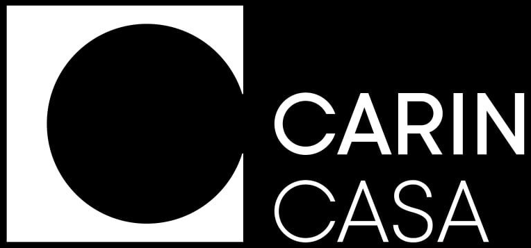

<h1 align="center">CARINCASA</h1>

## Description

This concept application was developed for the company CARINCSA as a thesis. It implements representations of: goods, individual goods and augmented reality. In this application, the user can view the list of products, sort it by type of product, change it to a convenient representation (in one or two columns), find out detailed information about the product, choose the configurations that suit him and see with the help of augmented reality how the furniture in his house will look like.

## About the project
### Technologies used
- The **SDWebImage** library was used to download and cache images. The rest of the code was written with native Swift;
- The MVVM architecture was chosen because it will be easy to test, and it is also one of the easily scalable architectures;
- CompositionalLayout was used for the views, which was both an excellent choice and a torment. I express my great gratitude to [Evgeny Popov](https://github.com/eugeneMedia) for his help with it.

